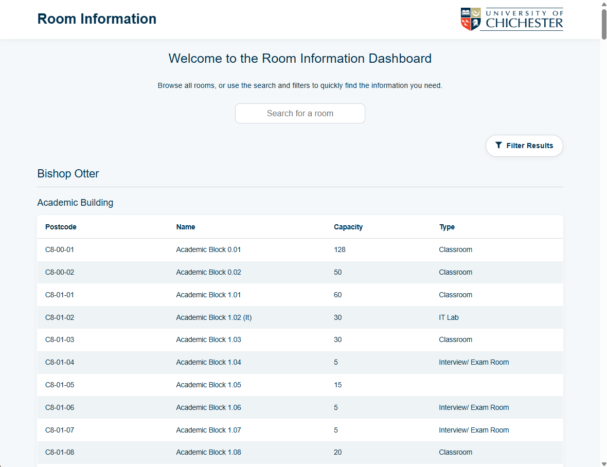
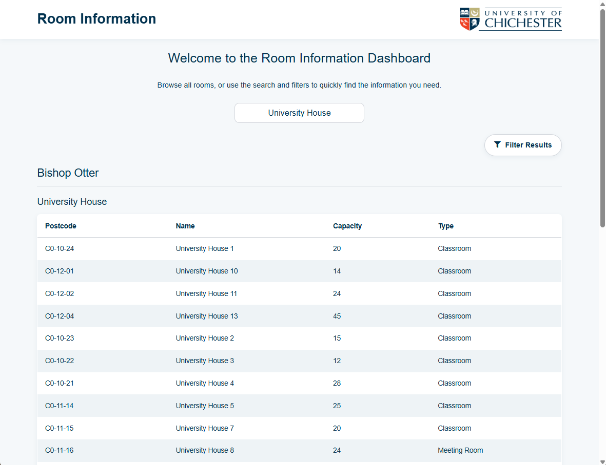
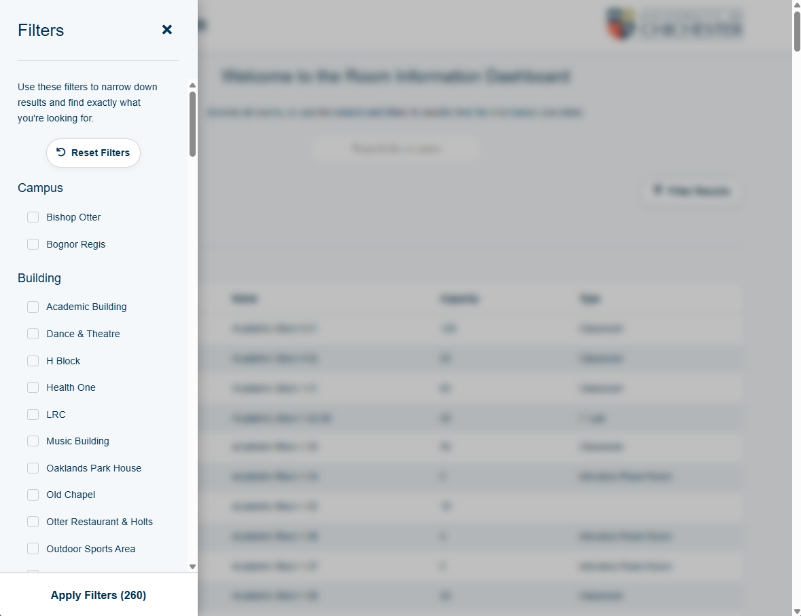
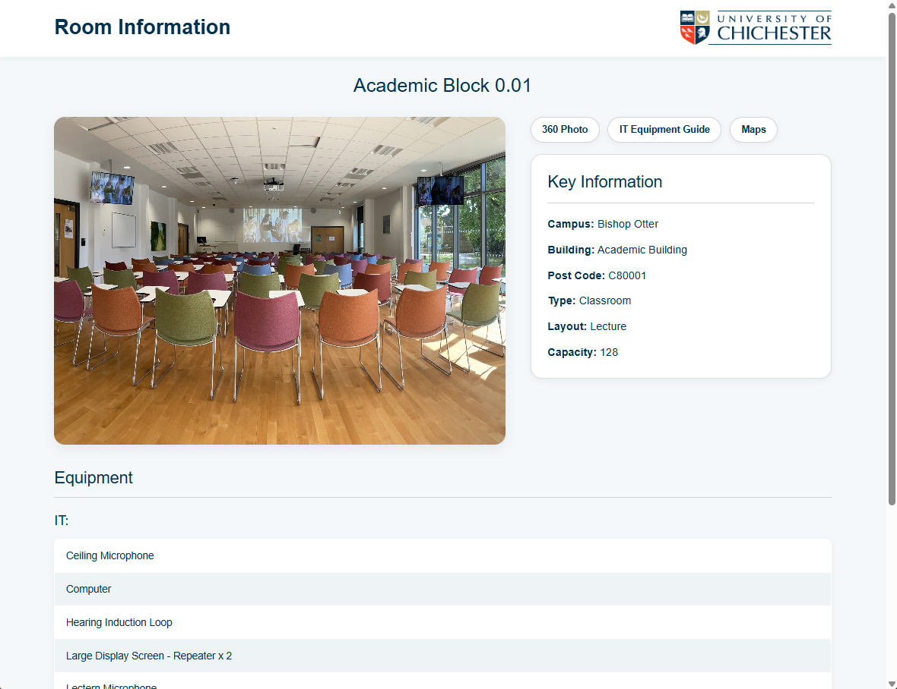
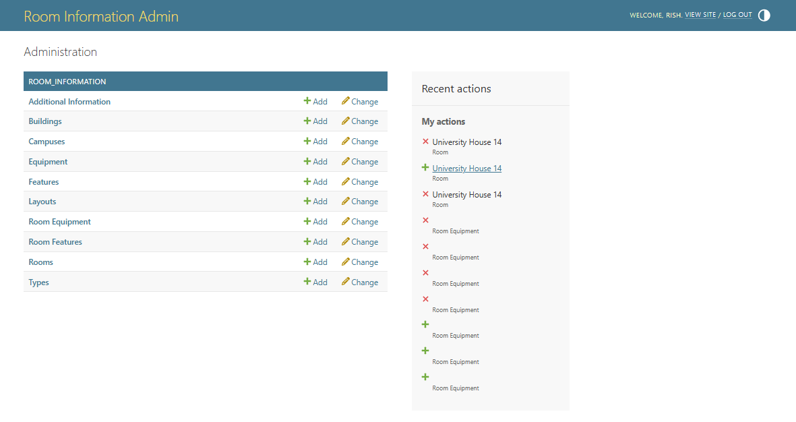

# Room Information System

> **Portfolio Showcase**
> This repository showcases my final-year dissertation project completed as part of my Digital Technology Solutions Degree Apprenticeship at the University of Chichester.
>
> The project involved the redevelopment of the university's Room Information System, replacing a legacy application with a modern, maintainable solution built using Django.
>
> The source code is not publicly available as it was developed during my employment and remains the intellectual property of the University of Chichester.

---

# Project Overview

The Room Information System is a full-stack web application designed to provide staff, students and visitors with access to information about teaching spaces across the University of Chichester.

Users are able to search and filter rooms using a variety of criteria before viewing detailed information including room location, floor, capacity and available equipment.

The project was undertaken as my final-year dissertation while simultaneously addressing a genuine business need within the university.

The application is currently in development and is scheduled for deployment during **August 2026**.

---

# Background

The university's existing Room Information System had been developed several years previously using Adobe ColdFusion by a former employee.

Although the application continued to function, it presented several long-term challenges:

* An outdated user interface and user experience
* Limited maintainability
* Technology no longer aligned with the university's internal development expertise
* Increasing technical debt
* Difficulty implementing new functionality

To address these issues, the decision was made to redevelop the application using technologies already used within the university's software development team.

The redevelopment forms the basis of my final-year dissertation while also delivering a modern replacement for an existing production system.

---

# Project Objectives

The project aimed to:

* Redevelop the existing Room Information System
* Improve usability through a modern user interface
* Enhance the overall user experience
* Design a new relational database
* Clean and restructure legacy data
* Improve maintainability
* Align the application with the university's current technology stack
* Deliver a scalable platform for future development

---

# Key Features

## Room Search

* Search rooms by multiple criteria
* Filter results
* Fast room lookup

## Room Information

* Room location
* Floor information
* Capacity
* Equipment available
* Additional room details

## Data Management

* Structured relational database
* Improved data integrity
* Cleaned legacy data

---

# Technologies Used

## Backend

* Django
* Python

## Database

* MySQL

## Frontend

* HTML5
* CSS3
* JavaScript

---

# My Contribution

I was responsible for the design and development of the new application, including:

* Requirements gathering
* Analysing the existing legacy system
* Database design
* Data migration planning
* Developing Python scripts to clean and restructure legacy data
* Building the Django backend
* Developing the frontend
* Improving the user interface and user experience
* Testing and validation
* Dissertation research and documentation

---

# System Architecture

```text
Legacy ColdFusion Application
            │
            ▼
     Legacy Data Sources
            │
            ▼
 Python Data Cleaning Scripts
            │
            ▼
      New MySQL Database
            │
            ▼
       Django Web Application
            │
            ▼
      Public Room Information
```

---

# Skills Demonstrated

This project demonstrates experience with:

* Full-stack web development
* Django
* Python
* MySQL
* Database design
* Data migration
* Legacy system modernisation
* UI/UX redesign
* Requirements analysis
* Software architecture
* Software maintenance
* Working with real stakeholders

---

# Challenges

The redevelopment involved significantly more than rebuilding the application's interface.

Some of the primary challenges included:

* Understanding an existing legacy application
* Designing a modern replacement
* Cleaning and restructuring inconsistent historical data
* Creating a maintainable database design
* Preserving existing functionality while improving usability
* Balancing academic research with real-world software development

---

# Screenshots

## Home Page



---

## Room Search



---

## Room Filters



---

## Room Details



---

## Administration Portal



---

# What I Learned

This project strengthened my understanding of:

* Modernising legacy software
* Database design
* Data migration strategies
* Full-stack application development
* User-centred design
* Working with stakeholders
* Managing large software projects
* Applying software engineering principles within a production environment

---

# Current Status

* ✅ Development complete (or update this as appropriate)
* ✅ Dissertation submitted
* 🚀 Deployment planned for **August 2026**
* 🔄 Ongoing refinements based on stakeholder feedback

---

# Project Outcome

The project provides the University of Chichester with a modern, maintainable replacement for its existing Room Information System.

By adopting Django and a redesigned relational database, the application aligns with the university's current development capabilities while providing an improved experience for end users and a platform that can be more easily maintained and extended in the future.

---

# Repository Purpose

This repository exists to showcase my final-year dissertation project and the software engineering practices applied throughout its development.

Although the source code cannot be published, the project demonstrates my experience modernising legacy software, designing new data models, developing full-stack web applications and delivering software to meet genuine organisational requirements.
